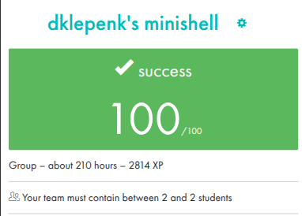
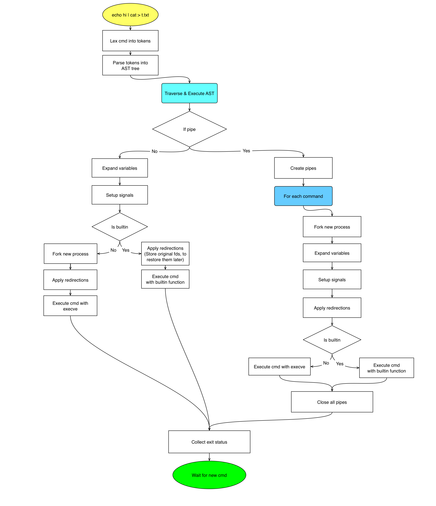
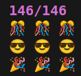

<div align="center">
<h1>🐚 Minishell</h1>
<p><b>A lightweight Bash-compatible shell built in C</b></p>

</div>

## 🧠 System Architecture

<p align="center">

</p>
<p align="center"><sub><i>Executor-oriented logic flow (Design by workani)</i></sub></p>


Minishell is built around a recursive execution tree that cleanly separates parsing from execution. This architecture enables unlimited pipe depth while keeping process control predictable and robust.

<div align="center">
  <h3>Execution flow</h3>
</div>

<ol>
  <li><strong>Lexing and Parsing:</strong> User input is tokenized and transformed into an Abstract Syntax Tree (AST).</li>
  <li><strong>Tree Traversal:</strong> The execution engine walks the AST, resolving pipes, redirections, and built-in commands.</li>
  <li><strong>Process Orchestration:</strong> Processes are forked, signals are configured, and I/O is redirected before handing control to <code>execve</code>.</li>
</ol>

## ✨ Supported Features

### Command execution
* External commands via `PATH` using `execve`.
* Built-ins executed in-process when required.
* Correct exit status propagation (`$?`).

### Pipelines
* Unlimited pipe depth using an AST-based executor.
* Proper file descriptor management.
* Built-ins and external commands mixed safely.

### Redirections
* `<`, `>`, `>>`, `<<` (heredoc with delimiter handling).
* Redirections resolved per AST node.

### Quoting & expansion
* Single `'` and double `"` quotes with Bash-like behavior.
* `$VAR` and `$?` expansion.
* Correct expansion order.

### Signals & interaction
* `ctrl-C` resets prompt.
* `ctrl-D` exits.
* `ctrl-\` ignored.
* Isolated signal handling for parent and children.

### Built-ins
* `echo -n`, `cd`, `pwd`, `export`, `unset`, `env`, `exit`.

## 🛠️ Credits

* **workani** (Backend & Stability)
    * Project architecture and initial research.
    * Core execution loop: pipes, forks, and process management.
    * Memory safety and leak patching.

* **mbondare** (Parser & Signals)
    * Lexer and parser implementation.
    * Signal handling and interactive prompt.

* **Joint Effort**
    * Redirections, executor integration, and fixing edge cases.

## 🚀 Usage

**Build:**
```bash
make
```

**Run:**
```bash
./minishell
```

## 🧪 Testing

<p align="center">

</p>

You can launch the verification suite shown above by following these steps:

1. Clone repository:
   ```bash
   git clone https://github.com/LucasKuhn/minishell_tester
   ```

2. Run:
   ```bash
   cd minishell_tester
   ./tester
   ```